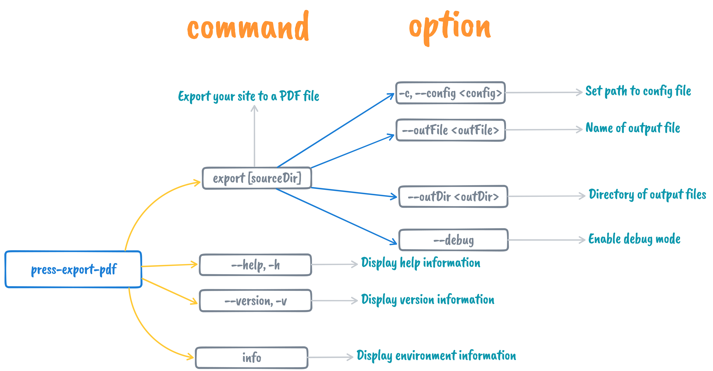
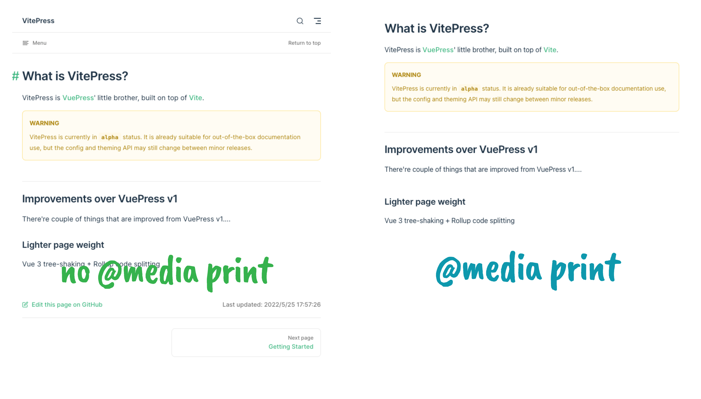

# vitepress-export-pdf

<p align="center">
    <a href="https://www.npmjs.com/package/vitepress-export-pdf" target="__blank">
        
    </a>
    <a href="https://www.npmjs.com/package/vitepress-export-pdf" target="__blank">
        
    </a>
    <br />
</p>

`vitepress-export-pdf` allows you to export your sites to a PDF file.

**Note: Because vitepress is still in alpha version**, the API may face changes, so this package is also released as alpha version.

## Related

- [@condorhero/vuepress-plugin-export-pdf](https://github.com/condorheroblog/vuepress-plugin/blob/main/packages/vuepress-plugin-export-pdf/README.md)
- [@condorhero/vuepress-plugin-export-pdf-v2](https://github.com/condorheroblog/vuepress-plugin/blob/main/packages/vuepress-plugin-export-pdf-v2/README.md)

## Installation

```sh
npm install vitepress-export-pdf -D
```

then add script to your `package.json`:

```json
{
  "scripts": {
    "export-pdf": "press-export-pdf export [path/to/your/docs]"
  }
}
```

Then run:

```sh
npm run export-pdf
```

## Usage

The package provides the `press-export-pdf` command with the following command line options:



- `export [sourceDir]`: Export your site to a PDF file
  - `-c, --config <config>`: Set path to config file
  - `--outFile <outFile>`: Name of output file
  - `--outDir <outDir>`: Directory of output files
  - `--debug`: Enable debug mode
- `info`: Display environment information
- `--help`: Display help information
- `--version`: Display version information

## Config options

You can create a new config file, we support the following files:

- `vitepress-pdf.config.ts`
- `vitepress-pdf.config.js`
- `vitepress-pdf.config.cjs`
- `vitepress-pdf.config.mjs`
- `.vitepress/vitepress-pdf.config.ts`
- `.vitepress/vitepress-pdf.config.js`
- `.vitepress/vitepress-pdf.config.cjs`
- `.vitepress/vitepress-pdf.config.mjs`

In addition, you can also customize the configuration file through `--config` or `-c`.

It is recommended to use TS(`.vitepress/vitepress-pdf.config.ts`) files, which are easy to manage and have **friendly code prompts**.

ex:

```ts
// .vitepress/vitepress-pdf.config.ts
import { defineUserConfig } from 'vitepress-export-pdf'

export default defineUserConfig({
  // ...
})
```

if you want to use JS files, **you can leverage your IDE's intellisense with jsdoc type hints**:

```js
/**
 * @type {import('vitepress-export-pdf').UserConfig}
 */
const config = {
  // ...
}

export default config
```

config options:

- `sorter` - function for changing pages order (default `undefined`)
- `outFile` - name of output file (default `vitepress-YYMMDD-HHmmss.pdf`)
- `outDir` - Directory of output files (default `package.json` file exists in directory)
- `routePatterns` - Specify the patterns of files you want to be exported. The patterns are relative to the source directory (default `["/**", "!/404.html"]`).Patterns to match Route path using [multimatch](https://github.com/sindresorhus/multimatch)
- `puppeteerLaunchOptions` - [Puppeteer launch options object](https://github.com/puppeteer/puppeteer/blob/main/docs/api/puppeteer.puppeteerlaunchoptions.md)
- `pdfOptions` - [Valid options to configure PDF generation via Page.pdf()](https://github.com/puppeteer/puppeteer/blob/main/docs/api/puppeteer.pdfoptions.md) (default `{ format: 'A4 }`)
- `enhanceApp` - Enhanceapp is a function that is executed before generating PDF. It receives two parameters: the created [browser](https://github.com/puppeteer/puppeteer/blob/main/docs/api/puppeteer.browser.md) instance and the [page](https://github.com/puppeteer/puppeteer/blob/main/docs/api/puppeteer.page.md) instance

## PDF print style

Unlike VuePress, VitePress has no customization [global style](https://v2.vuepress.vuejs.org/reference/default-theme/styles.html)(ex VuePress2.x `.vuepress/styles/index.scss`) function, but we can customize themes to achieve this.

create the `.vitepress/theme/index.ts` or `.vitepress/theme/index.js` file (the "theme entry file").

```ts
// .vitepress/theme/index.ts
import DefaultTheme from 'vitepress/theme'

// custom CSS
import './style/print.css'

export default {
  // Extending the Default Theme
  ...DefaultTheme,
}

```

create `/style/print.css`:

```css
@media print {
  .VPNav,
  .VPLocalNav,
  .VPDocFooter {
    display: none !important;
  }
}
```



## Examples

### Don't export homepage

`.vitepress/vitepress-pdf.config.ts` add `routePatterns`:

```ts
import { defineUserConfig } from 'vitepress-export-pdf'

export default defineUserConfig({
  routePatterns: ['!/'],
})
```

> Note: `!` at the beginning of a pattern will negate the match

Refer to [this example](./examples/vitepress-docs/) for more information，there is a very useful configuration file [vitepress-pdf.config.ts](./examples/vitepress-docs/docs/.vitepress/vitepress-pdf.config.ts)

## Contributing

1. Fork it!
2. Create your feature branch: git checkout -b my-new-feature
3. Commit your changes: git commit -am 'Add some feature'
4. Push to the branch: git push origin my-new-feature
5. Submit a pull request :D

## Report Bug

run `press-export-pdf info` Shows debugging information about the local environment.

## License

[MIT](https://github.com/condorheroblog/vitepress-export-pdf/blob/main/LICENSE)
